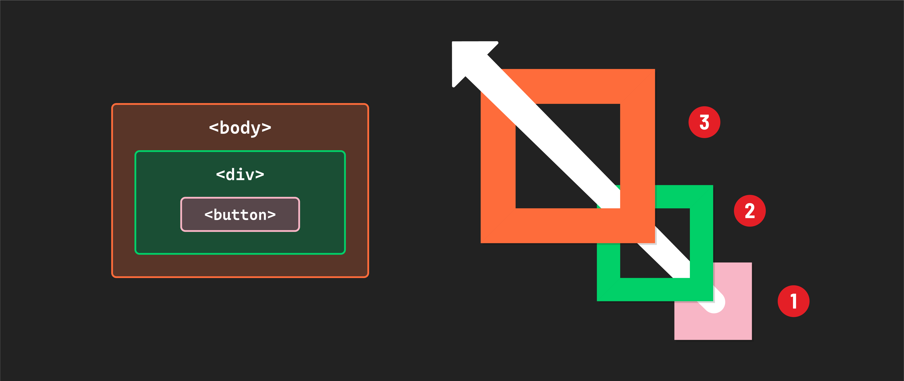

<h1>
  <span class="headline">DOM Events</span>
  <span class="subhead">Event Bubbling</span>
</h1>

**Learning objective:** By the end of this lesson, students will understand the concept of event bubbling in the DOM and how to use event delegation to handle events on multiple elements.

When an event occurs on an element, that event, whether it is listened to on that element or not, bubbles up through the DOM until it reaches the `document` object.



1. `<button>` Event triggered on the innermost element.
2. `<div>` Event bubbles up to the parent element.
3. `<body>` Event continues bubbling up to outer elements.

All event listeners registered for the same event, such as `click`, will be invoked along the path to the `document` element - unless one of those listeners calls the event object's `stopPropagation` method.

We'll observe event bubbling from the perspective of the like and dislike buttons that we created earlier:

```html
<body>
  <!-- other elements -->
  <div>
    <button id="like-button">Like this post!</button>
    <button id="dislike-button">Dislike this post!</button>
  </div>
  <!-- other elements -->
<body>
```

To help us observe event bubbling, we'll select the body and the div from the DOM and cache them in `bodyElement` and `divElement`, respectively.

Next, in `js/app.js`, attach a 'click' listener to each element:

```javascript
const bodyElement = document.querySelector('body')
const divElement = document.querySelector('div')

bodyElement.addEventListener('click', () => {
  console.log('body')
})

divElement.addEventListener('click', () => {
  console.log('div')
})

const handleReaction = (event) => {

  // add a console log for the target's id:
  console.log(event.target.id)

  if (event.target.id === 'like-button') {
    likesCount = likesCount + 1;
    likeButtonElement.textContent = `${likesCount} like(s). Like this post!`;
  } else {
    dislikesCount = dislikesCount + 1;
    dislikeButtonElement.textContent = 
      `${dislikesCount} dislike(s). Dislike this post!`;
  }
};
```

Try clicking on the buttons, the shaded area around the buttons, and the body. Observe the console and see event bubbling in action!

## Event delegation

Imagine a web app, like a game, with many elements that respond to a click event. There could be tens, hundreds, or more of these elements.

That would be a lot of listeners and would take a lot of code to make work. Plus, whenever a new element is added, an event listener must be registered!

Event bubbling allows us to implement what's known as event delegation. Event delegation allows us to register a single event listener that can respond to events triggered by any of its descendants. Super handy!

Test this with the `divElement` event listener you just created - have it call the `handleReaction` function instead:

```javascript
// comment out the lines attaching event listeners to your buttons
// likeButtonElement.addEventListener('click', handleReaction);
// dislikeButtonElement.addEventListener('click', handleReaction);

// make the divElement event listener call the handleReaction function
divElement.addEventListener('click', handleReaction)
```

We replaced two event listeners with one! Notably, the `event` object's `target` property is set to the actual element clicked, so all of the code we already wrote is largely still valid!

## 🎓 You Do

There has been a bug introduced into this code when we made this change. Track it down, and fix it.

Hint: Click on the shaded `<div>` element in the browser (not the buttons), observe what's happening, and figure out why!
