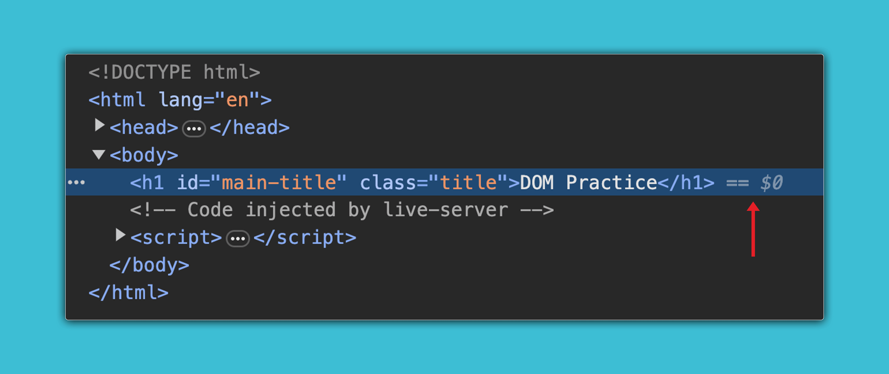

<h1>
  <span class="headline">Intro to the DOM</span>
  <span class="subhead">Selecting an Element</span>
</h1>

**Learning objective:** By the end of this lesson, students will be able to select an element from the DOM using `querySelector()` in JavaScript.

## Selecting in the browser

Let's start exploring the DOM with Chrome's DevTools.

With the `index.html` file open in your browser, open the DevTools:

- In macOS, use `⌘ Command` + `Shift` + `C`
- In Windows or Linux, use  `Ctrl` + `Shift` + `C`

Click on the **Elements** tab to browse the HTML hierarchy of the DOM.

Look closely after the closing `</h1>` tag - you see that *`== $0`*?



That tells us that the browser has created a variable named `$0` that represents the `<h1>` element in the DOM!

Click on the **Console** tab, and let's explore the properties on the `$0` element/object by typing `console.dir($0)`.

You can now explore the `<h1>` element's DOM object - aka the `<h1>` node.

## Selecting with `querySelector()`

Now that we've explored the DOM a bit in the browser, let's talk about how we can select these same elements using our code. In web development, selecting elements on a webpage is a fundamental skill. For this, we use `querySelector()`.

[`querySelector()`](https://developer.mozilla.org/en-US/docs/Web/API/Document/querySelector) is a method of the `document` object. It lets us select a single element on the webpage using CSS selectors. This is similar to how we select elements for styling with CSS.

To use `querySelector()`, you provide a string that matches the CSS selector of the element you want to select. Here's an example:

```javascript
const titleElement = document.querySelector('#main-title');
console.dir(titleElement);
```

In this code, we're doing a few important things:

- **Selecting an Element:** We use `querySelector()` to find the element with the `id` of `main-title`. This is the same way we'd target an element in CSS.
- **Storing the Element:** We store the selected element in a variable named `titleElement`. This way, we can easily use it later in our code.
- **Naming Conventions:** Notice the name `titleElement`. Adding `Element` or `El` to the end of variable names holding DOM elements is a good practice. It helps us quickly identify that the variable is an element, not just a piece of data.
- **Verification with console.dir:** Right after selecting the element, we use `console.dir(titleElement)` to display its properties in the console. We do this to confirm we have selected the correct element from the DOM. You should ***always*** follow this pattern in your apps

> ♻ **Repeatable Pattern:** Every time you select an element out of the DOM, you should `console.dir()` it to confirm it is what you think it is!

> ❓ Could we use any other CSS selectors to retrieve this same element?

### More than one match

If the CSS selector provided to `querySelector()` matches multiple elements, it returns the first matching element from the document. You should avoid this scenario by using a more specific selector (such as an `id`) that only matches one element when possible.

If no matching DOM element is found, `querySelector()` will return `null`.

### Caching elements

In the example above, we stored the result of `document.querySelector('#main-title)` to a variable (`titleElement`). We'll commonly refer to that variable as a *cached element reference*. That sounds fancy, but it means that we don't need to query the DOM repeatedly for the same element. When we want to interact with it, we use the variable.

> Creating *cached element references* is a technique in which a DOM element is stored in a variable for future use, minimizing the need to query the DOM to access the same element repeatedly. This phrase is derived from the term **caching** in computer science. Caching is a technique used in computing to store data temporarily in a local storage location, known as a cache, so that future requests for that data can be accessed faster.

This is important for a few reasons:

- We can write less code.
- Querying for elements in the DOM is prone to errors. Doing it less avoids some of those errors.
- It improves performance (querying for elements in the DOM is relatively slow).

### 🎓 You Do

1. In `index.html`, add a `<p>` tag below the `<h1>` and give it a `class` of `"cool"`.

2. Add some content inside the `<p>` tag. To do this quickly, try typing `lorem`, then hit `Tab` on your keyboard to insert placeholder text.

3. Use `document.querySelector()` to select the `<p>` element with a class of `cool` and assign it to a variable named `paragraphElement`.

4. Verify that the `<p>` element was selected by logging out `paragraphElement`.
