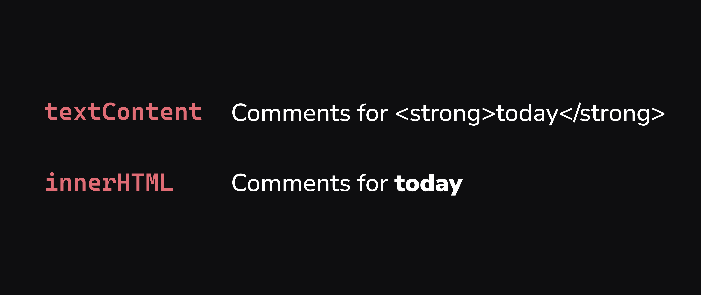

<h1>
  <span class="headline">Intro to the DOM</span>
  <span class="subhead">The <code>innerHTML</code> Property</span>
</h1>

**Learning objective:** By the end of this lesson, students will be able to use the `innerHTML` property to insert or update HTML content within a DOM element.

We've seen how to take actions on a DOM element, such as setting its text content with the `textContent` property, but what if we wanted to do something a little more complex, like add HTML inside of a DOM element? For that, there is `innerHTML`.

The [`innerHTML`](https://developer.mozilla.org/en-US/docs/Web/API/Element/innerHTML) property is used to retrieve and set content as HTML in the format of a string.

Let's check out changing the content of the `<p>` element by assigning the string **`Comments for <strong>today</strong>:`** first to `textContent`, then to `innerHTML`:

```javascript
paragraphElement.textContent = 'Comments for <strong>today</strong>:';
```

Observe that the HTML tag `<strong>` prints as plain text. It does not modify the HTML contents of the `paragraphElements`. Check out `innerHTML` next:

```javascript
paragraphElement.innerHTML = 'Comments for <strong>today</strong>:';
```



Now, the HTML that we wrote is no longer being interpreted as text but instead as actual HTML. If you want to include HTML, use `innerHTML`.

The power of `innerHTML` may not be evident at first. However, the assigned string can be as complex as you want - containing multiple elements with attributes, etc.

> 🚨 Never use any user-provided values in `innerHTML`. This could be dangerous unless the values have been properly cleaned up.
