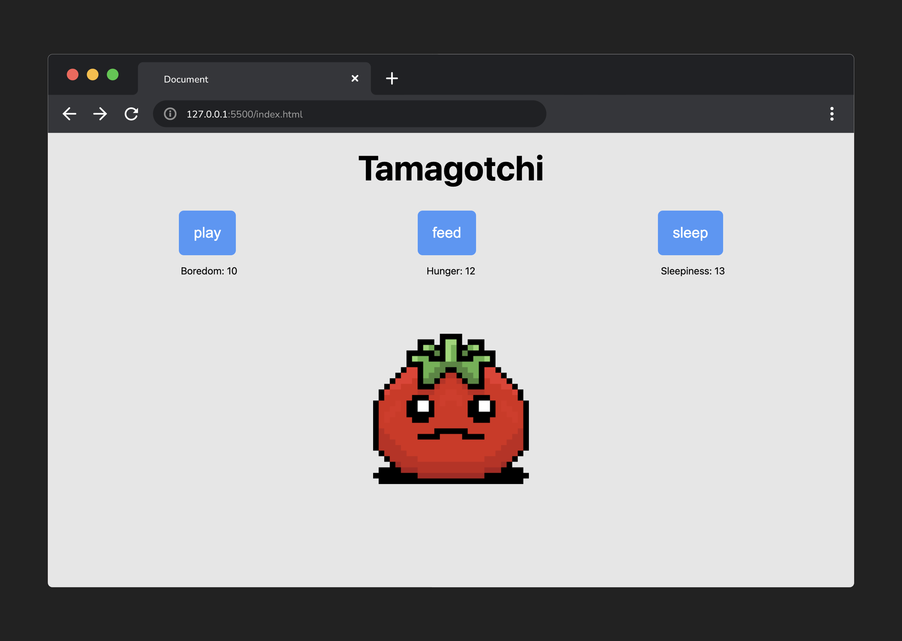

<h1>
  JavaScript Browser Game
  Tamagotchi Lab
</h1>

## About

Welcome to the JavaScript Browser Game Tamagotchi Lab, a nostalgic journey to the late '90s and early 2000s, when virtual pet simulators were all the rage!

In this lab, you will recreate a simplified version of this classic game, combining your knowledge of HTML, CSS, and DOM manipulation. You'll be faced with managing three critical statistics for your creature – boredom, hunger, and sleepiness – keeping them within a safe range to maintain a happy and healthy virtual pet.

While fun and engaging, this lab demonstrates the real-world application of these foundational web development skills, solidifying your understanding and preparing you for more complex projects.

## Content

- [Setup](./setup/README.md)
- [Exercise: Intro](./exercise-intro/README.md)
- [Exercise: Part 1 - 3](./exercise-1-3/README.md)
- [Exercise: Part 4 - 5](./exercise-4-5/README.md)
- [Exercise: Part 6 - 7](./exercise-6-7/README.md)

## Internal

### Prerequisites

- Foundational knowledge of HTML, CSS, and JavaScript
- Intro to the DOM
- DOM Events

### Time to complete

Estimated time to complete core lab exercise: **180 min**

### Solution code

🏁 [Solution code](https://git.generalassemb.ly/modular-curriculum-all-courses/javascript-browser-game-tamagotchi-lab-solution/)

### Deployed sites

🌐 [Live Example](https://pages.git.generalassemb.ly/modular-curriculum-all-courses/javascript-browser-game-tamagotchi-lab-solution/)

### Course landing pages

- [Default Landing Page](https://pages.git.generalassemb.ly/modular-curriculum-all-courses/javascript-browser-game-tamagotchi-lab/canvas-landing-pages/fallback)
- [SEB - Software Engineering Bootcamp](https://pages.git.generalassemb.ly/modular-curriculum-all-courses/javascript-browser-game-tamagotchi-lab/canvas-landing-pages/seb)

### Resources

✏️ [Instructor Guide](./internal-resources/instructor-guide.md)

🎥 [Video Hub](./internal-resources/video-hub.md)

🏗️ [Release Notes](./internal-resources/release-notes.md)

---

**Find a 👾 bug 👾 or have suggestions? [Let us know](https://pages.git.generalassemb.ly/modular-curriculum-all-courses/universal-resources-internal/module-feedback)!**
